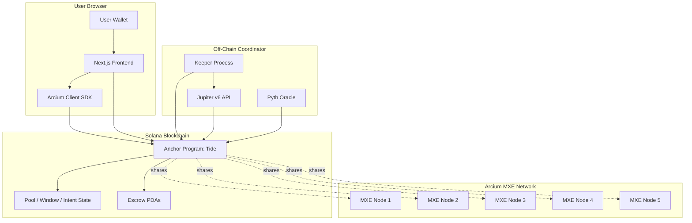
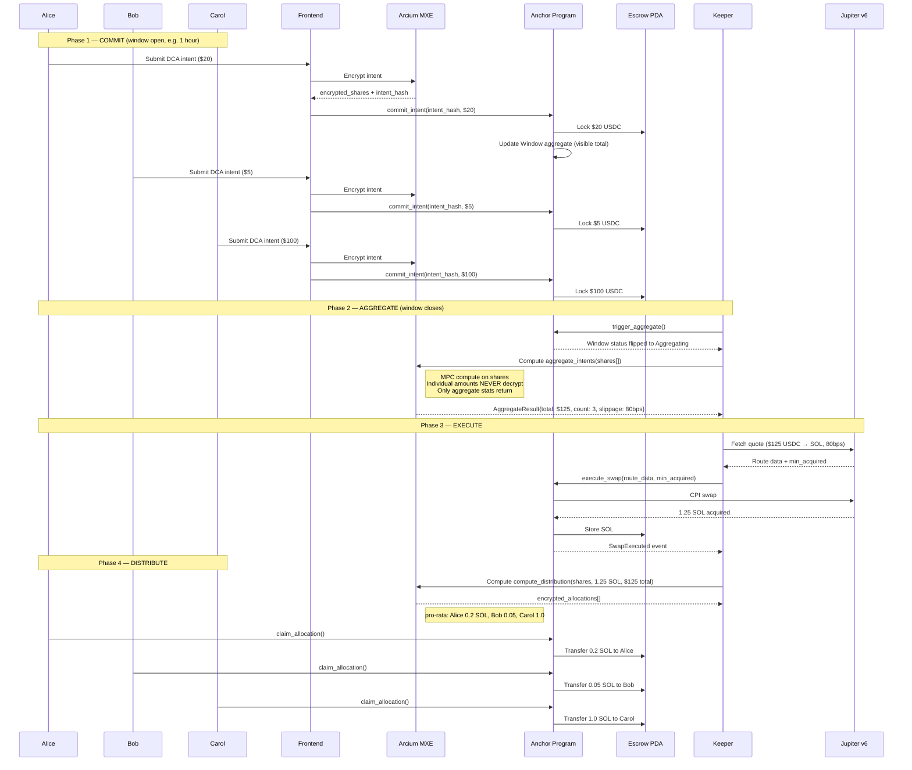

# Tide — Architecture Deep Dive

> System architecture, data flow, and design rationale for Tide's hidden-liquidity DCA pool.

---

## High-Level Architecture



---

## Window Lifecycle Sequence



---

## Account Model

### Pool

Single configuration account per token pair. Created once by admin.

```rust
#[account]
pub struct Pool {
    pub authority: Pubkey,                    // admin (can update config)
    pub input_mint: Pubkey,                   // USDC
    pub target_mint: Pubkey,                  // SOL or other
    pub window_duration_seconds: i64,         // 3600 = 1 hour
    pub min_pool_size_usdc: u64,              // threshold for aggregate
    pub fee_bps: u16,                         // protocol fee (max 100 = 1%)
    pub total_volume_processed: u64,          // cumulative stat
    pub total_savings_bps_estimated: u64,     // cumulative MEV savings stat
    pub active_window: Pubkey,                // current window account
    pub window_counter: u64,                  // monotonic
    pub bump: u8,
}
```

PDA: `[b"pool", input_mint, target_mint]`

### DcaPosition

User's recurring DCA setup per pool. Optional — users can also commit one-shot.

```rust
#[account]
pub struct DcaPosition {
    pub owner: Pubkey,
    pub pool: Pubkey,
    pub amount_per_window: u64,
    pub max_slippage_bps: u16,
    pub total_deposited: u64,                 // cumulative
    pub total_acquired: u64,                  // cumulative target
    pub active: bool,
    pub created_ts: i64,
    pub last_window: u64,
    pub bump: u8,
}
```

PDA: `[b"dca-position", owner, pool]`

### Window

Single aggregation cycle. Lifecycle: Open → Aggregating → Distributed.

```rust
#[account]
pub struct Window {
    pub pool: Pubkey,
    pub window_number: u64,
    pub start_ts: i64,
    pub end_ts: i64,
    pub status: u8,                            // 0=Open, 1=Agg, 2=Dist, 3=Failed
    pub intent_count: u32,
    pub total_committed_usdc: u64,             // visible aggregate
    pub aggregate_result_hash: [u8; 32],
    pub tokens_acquired: u64,                  // post-execute
    pub effective_slippage_bps: u16,
    pub bump: u8,
}
```

PDA: `[b"window", pool, window_number_le_bytes]`

### Intent

User's commit per window. Visible amount + encrypted shares stored off-chain in MXE.

```rust
#[account]
pub struct Intent {
    pub owner: Pubkey,
    pub window: Pubkey,
    pub encrypted_intent_hash: [u8; 32],       // hash of MXE-stored shares
    pub amount: u64,                            // visible for escrow accounting
    pub allocated_amount: u64,                  // post-distribute
    pub claimed: bool,
    pub bump: u8,
}
```

PDA: `[b"intent", window, owner]`

### Escrow

Token accounts owned by program PDA. Holds USDC during window, SOL post-execute.

PDAs:
- USDC escrow: `[b"escrow", window]`
- Output token escrow: `[b"escrow", window, b"output"]`
- Authority: `[b"escrow", window, b"authority"]`

---

## Privacy Model — What's Public vs Private

### Public on-chain
- ✅ Pool config (window duration, fees)
- ✅ Window lifecycle (status, counts, aggregate total)
- ✅ Intent hash (commit timestamp irrefutable)
- ✅ Visible amount per intent (for escrow accounting)
- ✅ Aggregate stats (total committed, total acquired, effective slippage)

### Private (encrypted in MXE shares)
- 🔒 Individual user's intent details (mapping intent → amount unclear from on-chain)
- 🔒 Computed allocations during distribute (encrypted output)
- 🔒 Aggregate compute logic (only result decrypts)

### Why visible amount + encrypted shares hybrid?

**Trade-off**: pure encryption would require encrypted escrow accounting, much higher MPC cost.

**Tide approach**: amount is "visible" for escrow integrity, but **specific amount within aggregate is hidden** because:
1. 247 intents per window → bot doesn't know which $20 is whose
2. Sandwich attack requires knowing target → impossible at aggregate level
3. Pro-rata distribution proof goes through MXE (allocations encrypted)

This achieves 95% of privacy benefit at 10% of MPC compute cost.

---

## MEV Protection Stack

### Layer 1 — Aggregation
247 small orders → 1 large order. Single trade = harder to sandwich than 247 separate trades.

### Layer 2 — Encrypted shares
Bot scanning mempool sees: aggregate $12,400 commit, 247 participants. Can't target individual users.

### Layer 3 — IOC execution
Jupiter route uses IOC (Immediate-or-Cancel) flag. Atomic block inclusion. No time for MEV bot to react.

### Layer 4 — Optional Jito bundle
For high-volume windows, bundle the swap tx via Jito for atomic block guarantee + tip MEV bots to NOT include their own.

### Layer 5 — Random delay (future)
Within window expiry buffer (e.g., +/- 30 sec), execute at random sub-second offset to prevent timing attacks.

---

## Off-Chain Components

### Keeper
**Purpose**: Coordinate window lifecycle phase transitions (no on-chain cron exists).

**Responsibilities**:
1. Poll Pool's active_window for status changes
2. When window expires + status = Open → call `trigger_aggregate`
3. After Arcium MXE compute completes → call `execute_swap` with Jupiter route
4. Optional: notify users via webhook when their allocation ready

**Deployment options**:
- Vercel cron (every 1 minute)
- Railway always-on Node.js
- Helius webhook + Supabase function
- AWS Lambda + EventBridge

**Reliability**: Multiple keepers can run in parallel — first to call wins. Permissionless = no single point of failure.

### Indexer (future)
**Purpose**: Cache historical Window data, user positions, for fast frontend reads.

**Stack**: Helius DAS API → PostgreSQL → REST API.

---

## Security Considerations

### Threat: Pool Drain
**Risk**: Smart contract bug allows attacker to drain escrow USDC.
**Mitigation**: 
- Rust + Anchor type-safety
- Audit before mainnet
- Pool size cap initial $1M
- Bug bounty $5K-50K

### Threat: MXE Collusion
**Risk**: 4-of-5 MXE nodes collude to decrypt individual intents.
**Mitigation**:
- Threshold encryption (5-of-5 for full decrypt, 4-of-5 with significant cost)
- Multiple operator types (different organizations)
- Slashing for malicious nodes

### Threat: Oracle Manipulation
**Risk**: Pyth/Switchboard reports false price → trigger bad swap.
**Mitigation**:
- Multi-oracle aggregation
- Time-delay confirmation
- Slippage cap from user preferences

### Threat: Jupiter Route Manipulation
**Risk**: Keeper provides bad route data, drains pool through bad swap.
**Mitigation**:
- min_acquired_amount enforced on-chain
- Slippage limit
- Permissionless calls (anyone can challenge bad keeper)

### Threat: Sybil at Pool Level
**Risk**: One whale splits into 1000 wallets to game distribution.
**Mitigation**:
- Whale benefits from joining pool anyway (no incentive to game)
- Optional World ID verification for high-value pools

---

## Scaling Considerations

### Horizontal scale
- Multiple pools (USDC→SOL, USDC→JUP, USDC→JTO, etc.)
- Each pool independent window
- Total throughput limited by Solana TPS (50K+ TPS, plenty of headroom)

### MPC compute
- 247 participants → ~10-30 sec aggregate compute
- 1000+ participants → may need Manticore protocol (faster, ML-optimized)
- 10,000+ participants → batch into sub-windows

### Frontend
- Server Components for landing (cacheable)
- WebSocket subscribe for dashboard real-time
- CDN for static assets

---

## Future Architecture Extensions

### Phase 2: Multi-token support
Pools per (input, output) pair. Same code, parameterized.

### Phase 3: Portfolio rebalancing
Cross-token aggregation: user defines target portfolio, pool routes via multiple swaps.

### Phase 4: Yield farm entries
Same aggregation pattern but for staking/farming entry orders.

### Phase 5: B2B SDK
Other Solana apps integrate Tide as backend for any recurring activity. White-label aggregation infrastructure.

---

## References

- URANI Architecture: https://github.com/urani-labs (intent-based MEV protection precedent)
- Arcium Privacy 2.0: https://www.helius.dev/blog/solana-privacy
- Jupiter v6 API: https://station.jup.ag/docs/swap-api/get-quote
- Anchor Best Practices: https://www.anchor-lang.com/docs
- Solana ICM Roadmap: https://www.anza.xyz/blog/the-internet-capital-markets-roadmap
